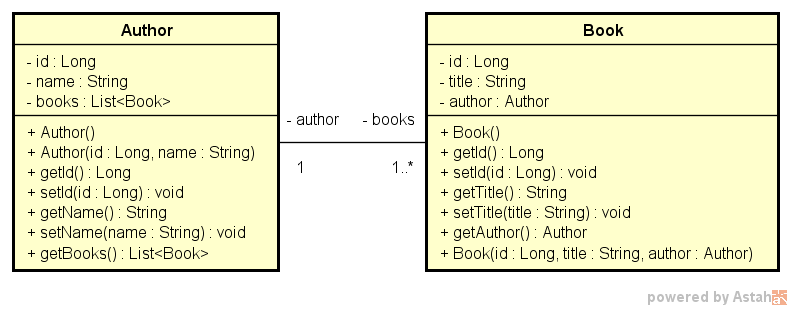
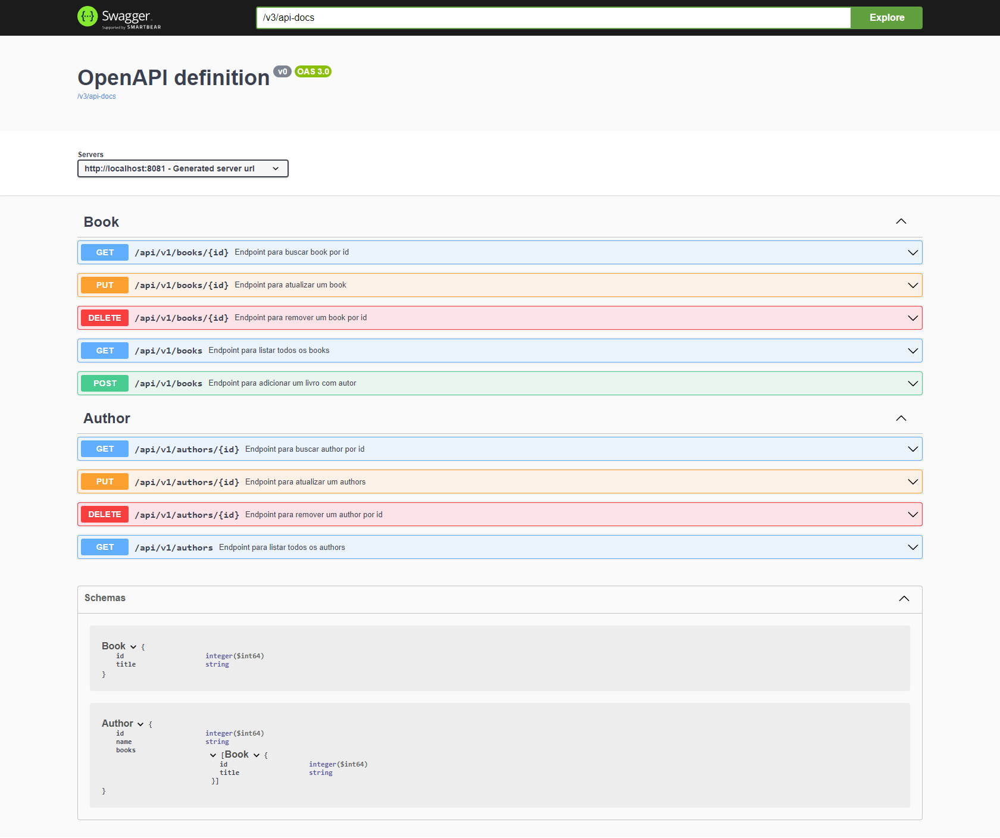

## Descrição

Este projeto é um exemplo de uma API REST desenvolvida em Java com o framework Spring e os módulos Spring MVC, Spring Boot Dev Tools, Spring Data JPA e o banco em memória H2 Database. Ele demonstra um relacionamento 1:N (um para muitos) entre as classes Author (Autor) e Book (Livro), com a capacidade de criar, listar e atualizar autores e livros.

## Requisitos

* Java 8 ou superior
* Spring

## Tecnologias

| Tecnologia         | Versão  |
| :----------------- | :------ |
| Java               | 8       |
| Spring             | 3.1.3   |
| H2 Database        | 2.1.214 |
| Springdoc Open API | 2.2.0   |

## Diagrama de classes

## Endpoints

### Book

| Método HTTP | Prefixo | Endpoint | Descrição                            |
| ----------- | ------- | -------- | ------------------------------------ |
| POST        | /api/v1 | /books   | Cria um livro com autor associado    |
| GET         | /api/v1 | /books   | Retorna uma lista de books           |
| GET         | /api/v1 | /books/1 | Retorna o book com o id 1            |
| PUT         | /api/v1 | /books/1 | Atualiza o título do book com o id 1 |
| DELETE      | /api/v1 | /books/1 | Remove o book com o id 1             |

### Author

| Método HTTP | Prefixo | Endpoint   | Descrição                                             |
| ----------- | ------- | ---------- | ----------------------------------------------------- |
| GET         | /api/v1 | /authors   | Retorna uma lista de authors e seus livros associados |
| GET         | /api/v1 | /authors/1 | Retorna o author com o id 1 e seus livros associados  |
| PUT         | /api/v1 | /authors/1 | Atualiza o nome do author com o id 1                  |
| DELETE      | /api/v1 | /authors/1 | Remove o author com o id 1                            |

## Collection do Postman para testes:

Download: [postman_collection.json](src/main/resources/docs/postman_collection.json)

## OpenAPI Definition

